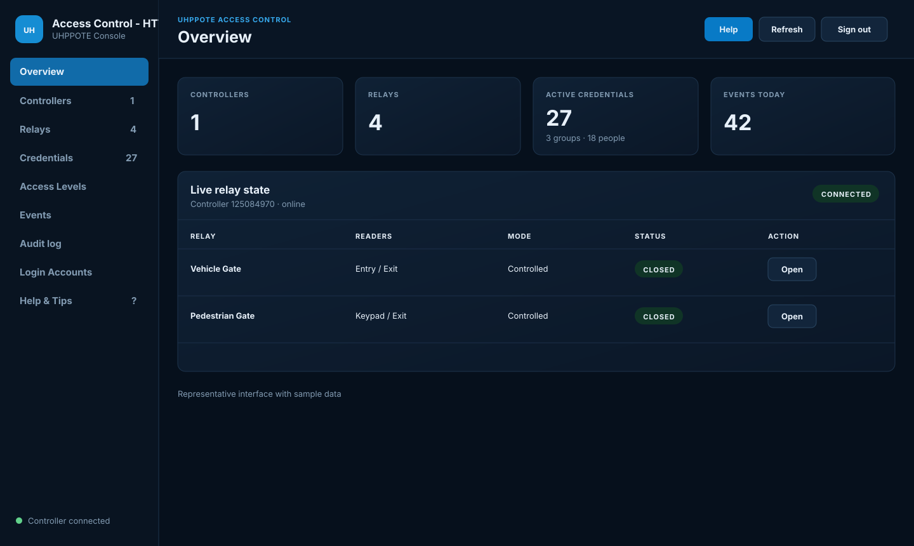
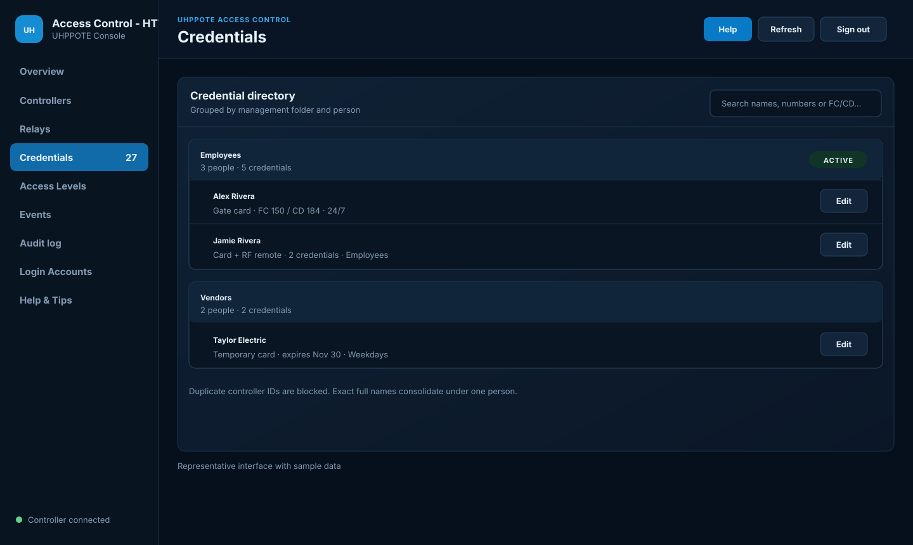
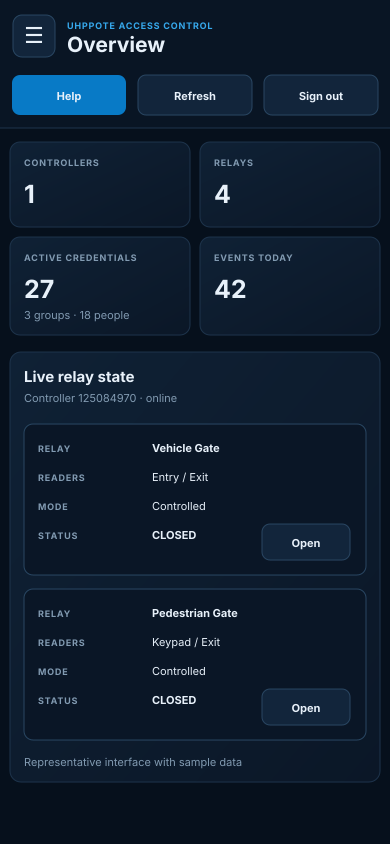

# Access Control - HTTP

A Docker-first web console for UHPPOTE TCP/IP access controllers. This fork builds on `uhppoted-httpd` with a redesigned desktop/mobile interface and controller-backed workflows for controllers, relays, credentials, access levels and events.

> This is an independently maintained fork. It does not modify or publish to the original author's repository. The upstream project is [uhppoted/uhppoted-httpd](https://github.com/uhppoted/uhppoted-httpd).

## Screenshots

The screenshots use sample names and controller data.

### Overview



### Credential management



### Phone layout



## What this build includes

- Responsive Access Control - HTTP theme, login screen and mobile card layouts
- Page-aware Help button and a built-in Help & Tips guide
- LAN controller discovery and controller configuration
- Live relay state, reader names and Open, Close and Controlled actions
- Credential management for cards, RF remotes and keypad codes
- Facility code (FC) and card decimal (CD) entry using `FC × 100000 + CD`
- Credential folders, consolidated people and duplicate credential protection
- Permanent Level 0 No Access and Level 1 24/7 access
- Controller-enforced access schedules that continue while the web app is offline
- Event search by credential, FC/CD, controller ID, name and credential type
- Safe controller import with Merge and Override choices
- Timestamped backup, download, import and restore workflows
- Administrator-managed login accounts
- Persistent JSON, CSV, audit and backup data under `/data`

## CasaOS / Docker Compose

UHPPOTE discovery uses UDP broadcast on port 60000. For a controller on the same LAN, use host networking. Bridge networking can serve the web page but usually prevents broadcast discovery and may also interfere with controller replies.

CasaOS installs this as one custom-app container:

```yaml
name: access-control-http
services:
  access-control-http:
    image: ghcr.io/mumbles1/uhppoted-httpd:latest
    container_name: access-control-http
    restart: unless-stopped
    network_mode: host
    environment:
      TZ: America/Chicago
      UHPPOTED_CREDENTIALS_CSV: /data/credentials.csv
      GATE_CONTROL_URL: ""
    volumes:
      - /DATA/AppData/uhppoted-httpd:/data
```

Open `http://<casaos-ip>:8080`. The container also exposes 8443 when HTTPS is configured. With `network_mode: host`, do not add Docker port mappings; the service binds directly to the CasaOS host ports.

Replace the blank `GATE_CONTROL_URL` value with the complete URL of the separate Gate Control app. The header's **← Gate Control** button uses that address after configuration work. If it remains blank, the button falls back to the external referring page or browser Back history.

In CasaOS, `/DATA/AppData/uhppoted-httpd` belongs under **Volumes**, not **Devices**. Mapping it as a device produces the Docker error “not a device node.”

## First sign-in and login accounts

On a new persistent data folder, open the web interface and complete the administrator setup. After sign-in, administrators can use **Login Accounts** to:

- add or edit a user;
- change a password;
- assign User or Administrator role;
- unlock a locked account;
- revoke OTP enrollment; and
- delete an account, except for the final administrator.

Account records persist in `/data/system/users.json`. Passwords are stored as salted hashes, not readable plaintext. On CasaOS that file is:

```text
/DATA/AppData/uhppoted-httpd/system/users.json
```

Do not hand-edit it while the container is running. Use **Login Accounts** or restore a known-good backup.

## Basic setup

1. Open **Controllers** and run discovery.
2. Configure the controller address, clock and physical relay assignments.
3. Name and configure the mapped relays from the controller dialog.
4. Create an **Access Level**, or use the built-in 24/7 level.
5. Add a **Credential** and assign at least one access level.
6. Confirm the success message says the controller synchronized.
7. Test the physical reader and verify the result under **Events**.

Local saves and controller synchronization are separate outcomes. If the UI reports that data was saved locally but synchronization failed, do not assume the physical controller received the change.

## Credentials and card numbers

The factory Windows application represents facility/card pairs using a combined decimal controller ID:

```text
controller ID = (facility code × 100000) + card decimal
```

For example, FC `150` and CD `184` become controller ID `15000184`. The UI displays FC before CD and blocks duplicate controller IDs. Exact full names are consolidated under one person, allowing one person to own multiple credentials.

Every credential must have an access level. **No Access** is exclusive and cannot be combined with another level.

## Persistent data and backups

Mounting `/DATA/AppData/uhppoted-httpd:/data` keeps configuration and records outside the image so container updates do not erase them.

```text
/DATA/AppData/uhppoted-httpd/
├── auth.json
├── credentials.csv
├── audit/
│   └── audit.log
├── backups/
│   └── access-control-YYYYMMDD-HHMMSS.zip
└── system/
    ├── controllers.json
    ├── doors.json
    ├── cards.json
    ├── groups.json
    ├── events.json
    ├── logs.json
    └── users.json
```

Use **Overview → Backups and restore** to create timestamped backups, download them, import an archive or restore an existing archive. Restore creates a safety backup first.

**Import from controller** is read-only until the preview is applied. It never deletes controller credentials. Matching credentials can be merged with local metadata or overridden with controller values, and a timestamped backup is created before applying the import.

## Updating

1. Create a backup from the Overview page.
2. Pull `ghcr.io/mumbles1/uhppoted-httpd:latest` in CasaOS.
3. Recreate or update the single container without deleting `/DATA/AppData/uhppoted-httpd`.
4. Refresh the browser and verify controller connectivity.

The image is public and supports anonymous pulls. Pin a digest instead of `latest` if you need fully repeatable deployments.

## Troubleshooting

### Controller is not discovered

- Use `network_mode: host`.
- Confirm the controller and CasaOS host are on the same LAN/VLAN.
- Allow UDP 60000 through the host firewall.
- Avoid Docker bridge mode for broadcast discovery.

### Web UI opens but changes do not reach the controller

- Verify the configured controller IP and device ID.
- Set the controller clock from **Controllers → Configure**.
- Watch the save result for a controller synchronization error.
- Confirm the factory application is not simultaneously changing the same controller.

### Relay status is unavailable

The controller must be reachable and the logical relay must be assigned to a physical controller channel. Status is not inferred from locally saved settings.

### Data disappears after an update

Confirm the host folder is mounted as a volume at `/data` and that CasaOS did not recreate the app without that mapping.

## Development

The backend remains Go so it can use the mature UHPPOTE protocol implementation directly. The custom browser UI is plain modern JavaScript, HTML and CSS served by the Go application.

Typical source build requirements are Go, Sass and Make. The production container is built and published by the mirror workflow in [mumbles1/uhppoted-docker-mirrors](https://github.com/mumbles1/uhppoted-docker-mirrors).

## Security

This is an administrative controller interface. Keep it on a trusted LAN or behind a properly secured reverse proxy/VPN. Do not expose HTTP port 8080 directly to the public internet. Back up `/DATA/AppData/uhppoted-httpd` and protect that folder because it contains system configuration, credential records and authentication hashes.

## License and upstream

This fork retains the upstream project license and attribution. See [LICENSE](LICENSE) and the [upstream project](https://github.com/uhppoted/uhppoted-httpd) for the original implementation and protocol ecosystem.
